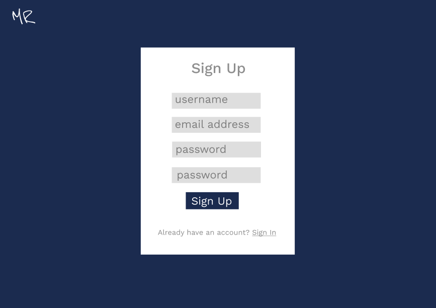
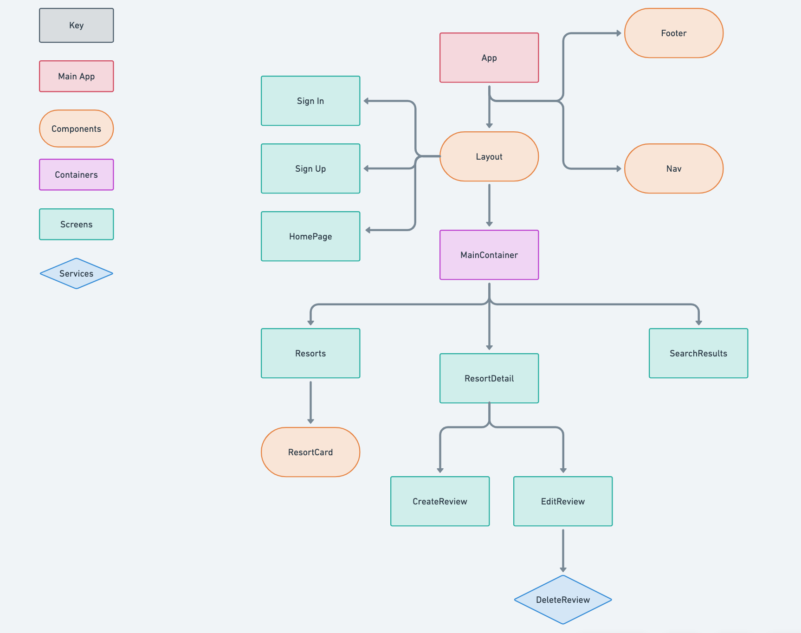

# Mountain Review

- [Overview](#overview)
- [MVP](#mvp)
  - [Goals](#goals)
  - [Libraries and Dependencies](#libraries-and-dependencies)
  - [Client (Front End)](#client-front-end)
    - [Wireframes](#wireframes)
    - [Component Hierarchy](#component-hierarchy)
    - [Component Architecture](#component-architecture)
    - [Time Estimates](#time-estimates)
  - [Server (Back End)](#server-back-end)
    - [ERD Model](#erd-model)
- [Post-MVP](#post-mvp)
- [Code Showcase](#code-showcase)
- [Code Issues & Resolutions](#code-issues--resolutions)

<br>

## Overview

_**Mountain Review** is a full-stack web application that allows winter sports enthusiasts to share their experience at a mountain resort with others. Built using Ruby on Rails and React, users can create reviews for a mountain resort_


<br>

## MVP

- RESTful JSON API built with Ruby on Rails
	- A database of 2+ tables
	- At least 1 association between tables
	- Full CRUD on the reviews table
- Front end built with React
	- 8+ separate components
	- Utilize React Router
	- Integrate with Ruby on Rails back end
	- Full CRUD on reviews
- Style with flexbox/grid
- Implement responsive design


<br>

### Goals

- Build a database of users, resorts, and reviews
- Allow a user to view all resorts and search resorts
- Allow a user to add, edit, and delete their own reviews

<br>

### Libraries and Dependencies

> Use this section to list all supporting libraries and dependencies, and their role in the project. Below is an example - this needs to be replaced!

|     Library      | Description                                |
| :--------------: | :----------------------------------------- |
|      React       | _Front-end framework using javascript_     |
|   React Router   | _Used for routing through React components_|
|    MaterialUI    | _Package for custom styling using React_ 	|
|   Ruby on Rails  | _Back-end framework for creating JSON API_ |
|     Axios        | _Used for making front-end API calls_ 		|
|     bcrypt       | _Used for password hashing_ 				|

<br>

### Client (Front End)

#### Wireframes

- Home Page


- Show Resorts


- Resort Detail


- Sign In


- Sign Up



- Create Review


- Detail with Edit


- Edit Review


- Search Results


#### Component Hierarchy



#### Component Architecture

``` structure

src
|__ assets/
      |__ fonts
      |__ graphics
      |__ images
      |__ css

|__ components/
      |__ Layout.js
      |__ Footer.js
      |__ Nav.js
      |__ ResortCard.js

|__ containers/
      |__ MainContainer.js

|__ screens/
      |__ HomePage.js
      |__ SignIn.js
      |__ SignUp.js
      |__ Resorts.js
      |__ SearchResults.js
      |__ ResortDetail.js
      |__ CreateReview.js
      |__ EditReview.js

|__ services/
	  |__ apiConfig.js
	  |__ auth.js
	  |__ resorts.js
	  |__ reviews.js

```

#### Time Estimates


| Task                | Priority | Estimated Time | Time Invested | Actual Time |
| ------------------- | :------: | :------------: | :-----------: | :---------: |
| Create tables/associations    	 |    H     |     1.5 hrs      |     TBD     |     TBD     |
| Create back-end routes/controllers |    H     |     3 hrs      |     TBD    |     TBD     |
| Test back-end CRUD actions 		 |    H     |     2 hr     |     TBD    |     TBD     |
| Deploy back-end   				 |    H     |     1 hr      |     TBD   |     TBD     |
| Create React app 					 |    H     |     1 hr      |     TBD     |     TBD     |
| Add Layout, Nav, Footer    		 |    L     |     3 hrs      |     TBD    |     TBD     |
| Add SignIn, SignUp, HomePage 	 	 |    H     |     3 hrs      |     TBD    |     TBD     |
| Add Resorts, Card, ResortDetail    |    H     |     3 hrs      |     TBD    |     TBD     |
| Add SearchResults  				 |    L     |     3 hrs      |     TBD    |     TBD     |
| Add Review CRUD actions  			 |    H     |     2.5 hrs      |     TBD    |     TBD     |
| Deploy front-end 					 |    H     |     1 hr      |     TBD    |     TBD     |
| Styling and media queries 		 |    H     |     10 hrs      |    TBD     |     TBD     |
| TOTAL               				 |          |     34 hrs     |     TBD     |     TBD     |

<br>

### Server (Back End)

#### ERD Model


<br>

***

## Post-MVP

- Add runs table as a child of resorts
- Add reviews to runs
- Add interactive map to find resorts by location
- Allow certain users admin access to create and update resorts

***

## Code Showcase


## Code Issues & Resolutions


